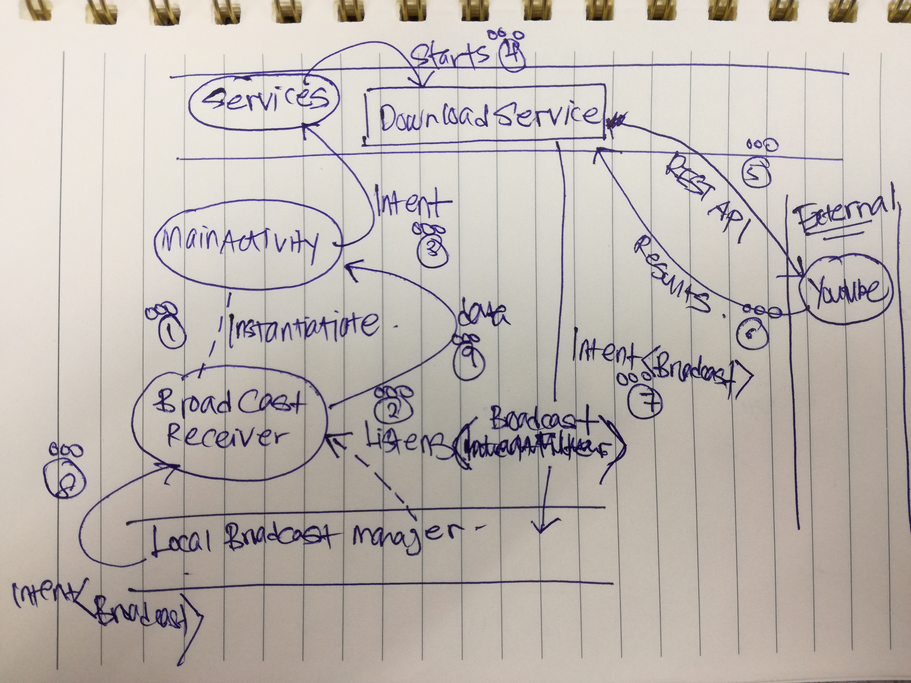

# Overview

Sample Android Application to download the most recent CNN YouTube listings and present it in `EditText`

# Notes

1. Desirable output format for Android Capstone.

2. `MainActivity` registers an instance of `BroadcastReceiver` then creates a dedicated instance of `Intent` to start the `Service` of `edu.vandy.mooc.aad_3_assg_1.assignment.services.DownloadAtomFeedService` that handles with method `onHandleIntent` that proxies the data back to `MainActivity` via an instance of `LocalBroadcastManager`. The `BroadcastReceiver` instance created earlier will be responsible to handle this proxy.

3. Using only one activity, `MainActivity`. Notice that a `BroadcastReceiver` Class is nested under the `MainActivity` Class.

4. `MainActivity#onResume` instantiates an `BroadcastReceiver` instance, store it into a local variable and then registers it with an `IntentFilter` of class `edu.vandy.mooc.aad_3_assg_1.assignment.activities.BROADCAST` into the `LocalBroadcastManager` instance.

5. This means the instance of `BroadcastReceiver` above will reponse to `Intent` with action signature of `edu.vandy.mooc.aad_3_assg_1.assignment.activities.BROADCAST`. Also see `BroadcastReceiver#onReceive` callback.

6. Uses implicit `Service` implementation. See `AndroidManifest.xml` for `service` tags.

7. Implicit `Service` started via `android.content.ContentWrapper#startService`.

8. `Service` uses dedicated Thread, not taging on UI Thread. Given a dedicated process name `:service_process`.

9. `Service` must be a subclass of `IntentService`. See `du.vandy.mooc.aad_3_assg_1.assignment.services.DownloadAtomFeedService`.

10. `IntentService`dispatch method, `onHandleIntent`.

11. `FlipperView` to display loading icon while programme fetches for data. Then updated with data when ready.

# Diagram Illustration

